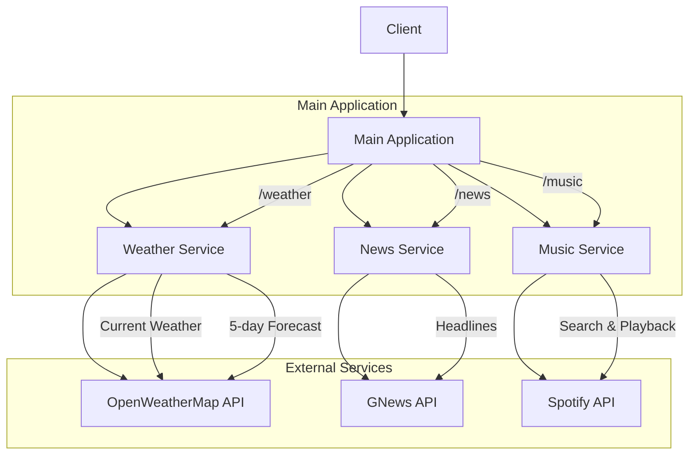

# AIWeatherArt Backend

A Flask-based microservices backend that integrates weather, news, and music services.

## Architecture



## Features

- **Weather Service**: Get current weather and 5-day forecast using OpenWeatherMap API
- **News Service**: Fetch latest news headlines by country and category using GNews API
- **Music Service**: Search and play music through Spotify API

## Setup

1. Install dependencies:
```bash
python setup.py
```

2. Run the application:
- Windows: `run.bat`
- Unix/Linux: `./run.sh`

## API Requirements

You'll need to obtain API keys from:
- [OpenWeatherMap](https://openweathermap.org/api)
- [GNews](https://gnews.io/)
- [Spotify Developer Dashboard](https://developer.spotify.com/dashboard/)

## Environment Variables

The following environment variables are required:
- `WEATHER_API_KEY`: OpenWeatherMap API key
- `GNEWS_API_KEY`: GNews API key
- `SPOTIPY_CLIENT_ID`: Spotify Client ID
- `SPOTIPY_CLIENT_SECRET`: Spotify Client Secret

## Development

### Project Structure
```
.
├── src/
│   ├── main.py         # Main application entry
│   ├── weather.py      # Weather service
│   ├── news.py         # News service
│   └── music.py        # Music service
├── test/
│   ├── test_weather.py
│   ├── test_news.py
│   └── test_music.py
├── requirements.txt
├── setup.py
└── run.bat/run.sh
```

### Testing

Run tests using pytest:
```bash
pytest test/
```
