# AIWeatherArt Backend

A Flask-based microservices backend that integrates weather, news, and music services through a unified API gateway.

## Architecture

```mermaid
graph TB
    %% Style definitions with higher contrast
    classDef external fill:#6741d9,stroke:#5933c6,stroke-width:2px,color:#fff
    classDef service fill:#0d6efd,stroke:#0a58ca,stroke-width:2px,color:#fff
    classDef main fill:#198754,stroke:#146c43,stroke-width:2px,color:#fff
    classDef api fill:#dc3545,stroke:#b02a37,stroke-width:2px,color:#fff

    %% Client node with new visual style
    Client(["🖥️ Client Applications"])
    
    %% Main Application components
    Gateway["API Gateway(DispatcherMiddleware)"]
    Weather["Weather Service/weather"]
    News["News Service/news"]
    Music["Music Service/music"]
    
    %% External APIs
    OpenWeather["OpenWeatherMap API(Weather Data)"]
    GNews["GNews API(News Feed)"]
    Spotify["Spotify API(Music Streaming)"]
    
    %% Subgraphs with darker borders
    subgraph MainApp[" Main Application (Flask) "]
        Gateway
        subgraph Services[" Microservices "]
            Weather
            News
            Music
        end
    end
    
    subgraph ExternalAPIs[" External APIs "]
        OpenWeather
        GNews
        Spotify
    end
    
    %% Connections with improved labels
    Client ---> Gateway
    Gateway --> Weather
    Gateway --> News
    Gateway --> Music
    
    Weather ---|Current Weather & Forecast| OpenWeather
    News ---|Headlines & Categories| GNews
    Music ---|Search & PlaybackOAuth2 Auth| Spotify
    
    %% Apply styles
    class Client external
    class Weather,News,Music service
    class MainApp main
    class OpenWeather,GNews,Spotify api

    %% Override subgraph styles
    style MainApp fill:#198754,stroke:#146c43,stroke-width:2px,color:#fff
    style Services fill:#0d6efd,stroke:#0a58ca,stroke-width:2px,color:#fff
    style ExternalAPIs fill:#f8f9fa,stroke:#343a40,stroke-width:2px,color:#000
```



## Features

### Weather Service (`/weather`)
- Real-time weather conditions
- 5-day weather forecasts
- Temperature, humidity, wind data
- Support for global cities

### News Service (`/news`)
- Latest news headlines by country
- Category filtering
- Custom search queries
- Multiple news sources

### Music Service (`/music`)
- Spotify integration
- Music search functionality
- Playback control
- OAuth2 authentication

## Setup

1. Install dependencies:
```bash
python setup.py
```

2. Run the application:
- Windows: `run.bat`
- Unix/Linux: `./run.sh`

## API Requirements

You'll need to obtain API keys from:
- [OpenWeatherMap](https://openweathermap.org/api)
- [GNews](https://gnews.io/)
- [Spotify Developer Dashboard](https://developer.spotify.com/dashboard/)

## Environment Variables

Required environment variables:
```env
WEATHER_API_KEY=your_openweathermap_api_key
GNEWS_API_KEY=your_gnews_api_key
SPOTIPY_CLIENT_ID=your_spotify_client_id
SPOTIPY_CLIENT_SECRET=your_spotify_client_secret
```

## Development

### Project Structure
```
.
├── src/
│   ├── main.py         # API Gateway & Main application
│   ├── weather.py      # Weather service implementation
│   ├── news.py         # News service implementation
│   └── music.py        # Music service implementation
├── test/
│   ├── test_weather.py # Weather service tests
│   ├── test_news.py    # News service tests
│   └── test_music.py   # Music service tests
├── requirements.txt    # Project dependencies
├── setup.py           # Installation script
└── run.bat/run.sh     # Startup scripts
```

### Testing

Run the test suite:
```bash
pytest test/
```

Individual service tests:
```bash
pytest test/test_weather.py
pytest test/test_news.py
pytest test/test_music.py
```

## API Documentation

### Weather Endpoints
- `weather/weather?city={city_name}` - Get current weather
- `weather/forecast?city={city_name}` - Get 5-day forecast

### News Endpoints
- `news/news?country={country_code}&category={category}` - Get news headlines
- `news/categories` - List available news categories

### Music Endpoints
- `music/search?q={query}` - Search for tracks
- `music/play` - Play selected track (requires authentication)
